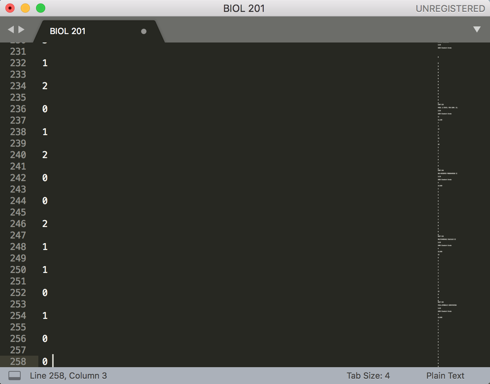

About grade plot
================
Plot the grade distribution of your class for a given semester at Concordia University.

Requirements
============
Make sure you have [Python3](https://www.python.org/downloads/) installed then run the following command to install the requirements.
```
pip install -r /path/to/requirement.txt
```

Usage
=====
### Step 1
Login on [myconcordia](https://my.concordia.ca).

### Step 2
Go to "My Student Centre">"View My Grades".

### Step 3
Click on the button to show all columns.

### Step 4
Copy the rows of the classes for which you want to plot the grade distribution and paste the text in a .txt file.



### Step 5
Run the following command:
```
python3 Main.py </path/to/input_file.txt> </path/to/ouput_file.pdf>
```
*Note: <output_file.pdf> should not already exist! However overriding the file is allowed.

Example
=======

